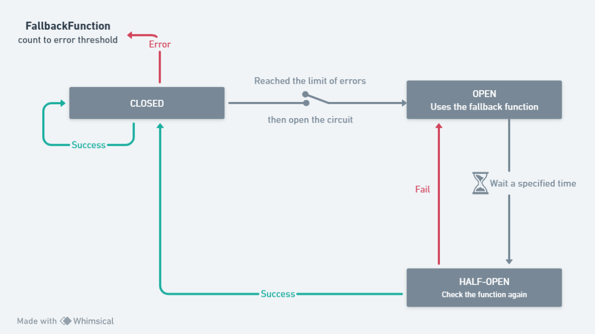

<p align="center">
  <a href="http://nestjs.com/" target="blank"></a>
</p>

[circleci-image]: https://img.shields.io/circleci/build/github/nestjs/nest/master?token=abc123def456
[circleci-url]: https://circleci.com/gh/nestjs/nest

  <p align="center">Nesjs Circuit Breaker </p>
    <p align="center">
</p>

## Description



This project is a simple implementation of [Circuit Breaker Pattern](https://en.wikipedia.org/wiki/Circuit_breaker_design_pattern) to be used as decorator in NestJS services
## Installation
tested in node 16.4

```bash
$ npm install nestjs-circuit-breaker
```

## Add to the App

```ts
export default class MyService {
    @CircuitBreaker({
        fallbackFunction: () => 'fallback return',
    })
    async execute() {
        ...
    }
}
```

## Cache Manager
this application uses the [NestJS Cache Manager](https://docs.nestjs.com/techniques/logger) by default. So your application need to configure this

## Parameters in Circuit Breaker
| Parameters                               | Description                                                                                              |
|-----------------------------------------|--------------------------------------------------------------------------------------------------------|
| `maxErrorsBeforeOpen`                   | Max errors until circuit breaker open and only use the fallback function                                      |
| `errorExpirationTimeInMilliseconds`     | Expiration time that will be used to decrement the count erros, this exists to avoid singular erros to be counted    |
| `maxAttemptsInHalfOpenState`            | Max number of parallel tryings in half open state. this doesnt change the flow of circuit breaker, so if have a error in any of the attempts the circuit breaker will be opened again             |
| `circuitCheckTimeoutInMilliseconds`     | Timeout until change the cricuit breaker status to HALF_OPEN.             |
| `fallbackFunction`                      | fallback function used when has an error in the service or when the circuit breaker is opened             |
| `logger`                                | (Optional) circuit breaker log, by default it uses the [NestJS Logger](https://docs.nestjs.com/techniques/logger)                     |
| `key`                                   | unique key used to handle circuit breaker in cache|


